# 🚖 TaxiReact

**TaxiReact** — это одностраничное приложение (SPA) для службы такси, разработанное с использованием **React + Vite**.  
Проект представляет собой **рефакторинг** [предыдущей PHP-версии с MySQL и Telegram API](https://github.com/OlehBilenkyi/Taxi), с акцентом на современный фронтенд, модульную структуру и лучшие практики React-разработки.

> 🛠️ **Старый проект**: [Taxi (PHP)](https://github.com/OlehBilenkyi/Taxi)

---

## 👥 Соавторы

- 👨‍💻 Основной разработчик: [Oleh Bilenkyi](https://github.com/OlehBilenkyi)
- 🤝 Идея и поддержка: Друг [Serhiy7](https://github.com/Serhiy7)

---

## 🚀 Технологии и стек

| Инструмент | Назначение |
|-----------|------------|
|  | Фреймворк для построения UI |
|  | Быстрый инструмент сборки |
|  | Стилизация и модульные CSS |
|  | Анализатор кода |
|  | Язык логики |
|  | Контроль версий |

---

## 📁 Структура проекта

```mermaid
graph TD
    A(["🚖 TaxiReact (Vite + React)"]):::root
    A --- B["⚙️ Configuration"]:::config
    A --- C["📦 Core"]:::core
    A --- D["🌐 Pages"]:::pages
    A --- E["🧩 Components"]:::components
    A --- F["🎨 Styling"]:::styles
    A --- G["🛠️ Utilities"]:::utils

    %% === Configuration ===
    B --> B1["📄 vite.config.js"]:::build
    B --> B2["📄 package.json"]:::build
    B --> B3["📄 .env"]:::security
    B --> B4["📄 .gitignore"]:::git

    %% === Core ===
    C --> C1["📄 main.jsx"]:::entry
    C --> C2["📄 App.jsx"]:::entry
    C --> C3["🔌 API Services"]:::api
    C3 --> C31["📄 api.js"]:::api
    C3 --> C32["📄 auth.js"]:::auth

    %% === Pages ===
    D --> D1["🏠 HomePage"]:::page
    D1 --> D11["Hero Section"]:::component
    D1 --> D12["Advantages"]:::component
    
    D --> D2["📰 NewsReviews"]:::page
    D2 --> D21["News List"]:::component
    D2 --> D22["Review Form"]:::component
    
    D --> D3["🚗 VehicleFleet"]:::page
    D3 --> D31["Car Gallery"]:::component
    D3 --> D32["Booking Form"]:::component
    
    D --> D4["🎥 Videos"]:::page
    D4 --> D41["Video Player"]:::component
    D4 --> D42["Playlist"]:::component

    %% === Components ===
    E --> E1["🧭 Layout"]:::layout
    E1 --> E11["📄 Header.jsx"]:::ui
    E1 --> E12["📄 Footer.jsx"]:::ui
    
    E --> E2["🔄 Reusables"]:::ui
    E2 --> E21["📄 Button.jsx"]:::ui
    E2 --> E22["📄 Modal.jsx"]:::ui
    E2 --> E23["📄 FormInput.jsx"]:::ui

    %% === Styling ===
    F --> F1["🎨 Global Styles"]:::css
    F1 --> F11["📄 variables.scss"]:::sass
    F1 --> F12["📄 reset.scss"]:::sass
    
    F --> F2["🧩 Component Styles"]:::css
    F2 --> F21["📄 Header.module.scss"]:::module
    F2 --> F22["📄 Button.module.scss"]:::module

    %% === Utilities ===
    G --> G1["🛠️ Hooks"]:::hooks
    G1 --> G11["📄 useAuth.js"]:::auth
    G1 --> G12["📄 useApi.js"]:::api
    
    G --> G2["🔧 Helpers"]:::helpers
    G2 --> G21["📄 formatter.js"]:::utils
    G2 --> G22["📄 validation.js"]:::utils

    classDef root fill:#f0f0f0,stroke:#333,stroke-width:3px
    classDef config fill:#e6f3ff,stroke:#4a90e2
    classDef core fill:#e1f5fe,stroke:#03a9f4
    classDef pages fill:#e8f5e9,stroke:#4caf50
    classDef components fill:#fff3e0,stroke:#ffa726
    classDef styles fill:#f3e5f5,stroke:#9c27b0
    classDef utils fill:#eceff1,stroke:#607d8b
    classDef build fill:#dcedc8,stroke:#8bc34a
    classDef security fill:#ffebee,stroke:#ff4444
    classDef git fill:#f5f5f5,stroke:#9e9e9e
    classDef entry fill:#e3f2fd,stroke:#2196f3
    classDef api fill:#e8eaf6,stroke:#3f51b5
    classDef auth fill:#fce4ec,stroke:#e91e63
    classDef page fill:#b3e5fc,stroke:#0288d1
    classDef component fill:#ffecb3,stroke:#ffa000
    classDef layout fill:#d7ccc8,stroke:#795548
    classDef ui fill:#c8e6c9,stroke:#66bb6a
    classDef css fill:#f8bbd0,stroke:#e91e63
    classDef sass fill:#f48fb1,stroke:#d81b60
    classDef module fill:#ffcdd2,stroke:#e53935
    classDef hooks fill:#b2ebf2,stroke:#00bcd4
    classDef helpers fill:#cfd8dc,stroke:#78909c
```

---

## 🧩 Страницы и компоненты

- **HomePage** — главная страница:
  - `Hero` — баннер с призывом
  - `Advantages` — преимущества службы
  - `NewsReviews` — отзывы и публикации
  - `VehicleFleet` — автопарк
  - `VideosOnYouTube` — видеоконтент

---

## 📦 Установка и запуск

```bash
# 1. Клонировать репозиторий
git clone https://github.com/OlehBilenkyi/TaxiReact.git
cd TaxiReact

# 2. Установить зависимости
npm install

# 3. Запустить в режиме разработки
npm run dev

# 4. Собрать проект для продакшена
npm run build
🔗 Старый проект (архив)
Если интересно, с чего всё начиналось — посмотри первую версию проекта на PHP:

📂 Taxi (Legacy PHP) — https://github.com/OlehBilenkyi/Taxi

📬 Контакты
Если у тебя есть вопросы или предложения — пиши:

GitHub: @OlehBilenkyi

Email: I3eLuy@gmail.com

📄 Лицензия
Этот проект распространяется под лицензией MIT. Подробнее смотри в LICENSE.

# 🚀 TaxiReact — Премиум SPA для такси с фокусом на UX и производительность

[](https://reactjs.org/)
[](https://vitejs.dev/)
[](https://opensource.org/licenses/MIT)


**TaxiReact** — это полный редизайн и рефакторинг старого PHP-проекта с переходом на современный React-стек. Мы создали быстрый, модульный и масштабируемый сервис для премиум-таси с продуманной архитектурой.

## 🔥 Ключевые особенности

### 🚀 Производительность
- **Vite** вместо Webpack — мгновенная сборка
- **Lazy-loading** компонентов
- Оптимизированные **WebP** изображения

### 💎 Интерфейс
```jsx
<HeroSection>
  <CTAButton>Вызвать такси</CTAButton>
</HeroSection>
Плавные анимации на CSS/SASS

Полностью адаптивный дизайн

Интуитивные модальные окна

🧩 Архитектура
Diagram
Code
graph TD
  A[Компоненты] --> B[Атомы]
  A --> C[Молекулы]
  A --> D[Организмы]
  B --> Button
  B --> Input
  C --> Form
  D --> Header
🛠 Технологический стек
Категория	Технологии
Фреймворк	React 18 + Hooks
Бандлер	Vite 4
Стили	SCSS Modules
Линтинг	ESLint + Prettier
API	Fetch + Custom Hooks
🖼 Скриншоты
Главная страница	Каталог авто
https://.../home.jpg	https://.../fleet.jpg
🚀 Быстрый старт
bash
git clone https://github.com/OlehBilenkyi/TaxiReact.git
cd TaxiReact
npm install
npm run dev
Откройте http://localhost:5173 в браузере.

📈 Дорожная карта
Подключение Node.js бекенда

Интеграция Google Maps API

Реализация PWA

Тесты (Jest + Testing Library)

🤝 Участие в проекте
PR приветствуются! Перед внесением изменений:

Создайте issue для обсуждения

Форкните репозиторий

Создайте feature-ветку

📜 Лицензия
MIT © Oleh Bilenkyi

📧 Контакты: I3eLuy@gmail.com |
🌐 Демо: taxireact-demo.vercel.app

text

### Рекомендации по использованию:
1. Замените ссылки на изображения на реальные скриншоты вашего проекта
2. Добавьте реальный gif-превью вместо плейсхолдера
3. Для Mermaid-диаграмм нужна поддержка GitHub (или используйте SVG)
4. Дополните раздел "Дорожная карта" конкретными задачами
5. Добавьте бейдж с размером проекта или покрытием кода (если есть тесты)

Такой формат:
- Хорошо выглядит на GitHub
- Содержит интерактивные элементы
- Легко читается
- Подчеркивает ключевые технологии
- Дает четкие инструкции по запуску
